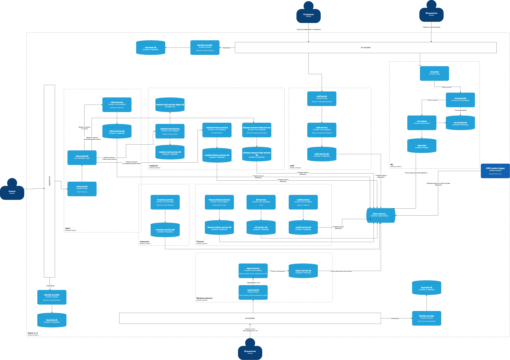

# Диаграмма контейнеров

# Описание узких мест. Метод MoSCoW

| Проблема                                                                                                         | Приоритет   |
|------------------------------------------------------------------------------------------------------------------|-------------|
| Долгое время построение отчетности, очень много данных (сотни терабайт) и вариантов их использования             | Must have   |
| Потенциальная точка отказа (DWH)                                                                                 | Must have   |
| Низкая производительность                                                                                        | Must have   |
| Отсутствие витрины данных                                                                                        | Must have   |
| Отсутствие микросервисной архитектуры                                                                            | Should have |
| Сложная масштабируемость                                                                                         | Should have |
| Отсутствие разграничения доступа                                                                                 | Should have |
| Использование устаревшего стека (Microsoft SQL-сервера 2008 года, Apache Camel). Сложно поддерживать и развивать | Should have |
| Отсутствие разделения по независимым доменам                                                                     | Should have |
| Отсутствие метрик и сборщика логов                                                                               | Could have  |