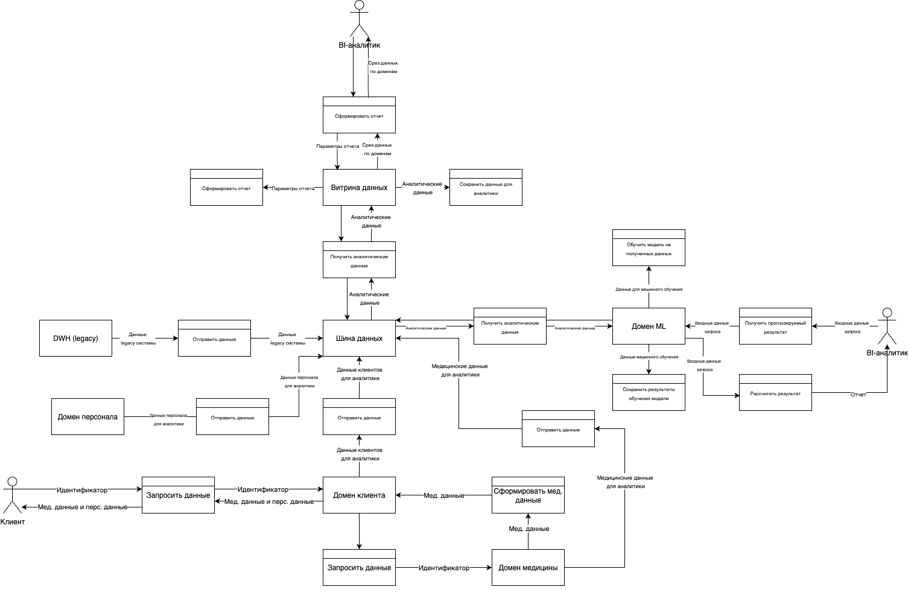

# Потоки данных между доменами

# Обоснование разделения системы на домены
- Масштабируемость системы и гибкость разработки. Домены независимы друг от друга, что позволяет развивать каждый домен отдельно. Потенциально ускорит time to market 
- Отдельный домен витрины данных существенно ускорит формирование отчетов вместо тяжелых запросов к DWH
- Устойчивость к рискам. Данные разных доменов можно разделять на разные уровни безопасности. Их легче контролировать
- Четкая ответственность за каждый домен. Руководство знает какая команда отвечает за каждый домен и какие задачи сейчас перед ней стоят
- Данные хранятся распределенно по разным доменам, а не находятся в единой точке отказа (монолите)