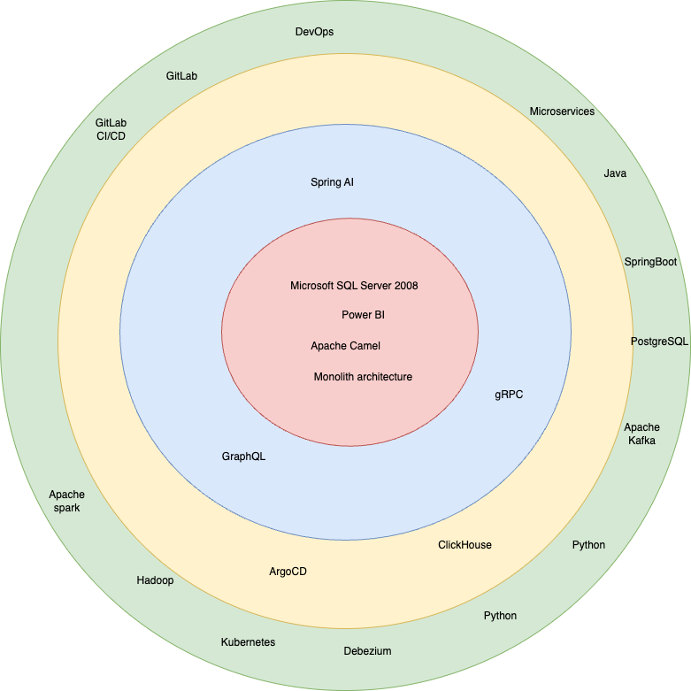
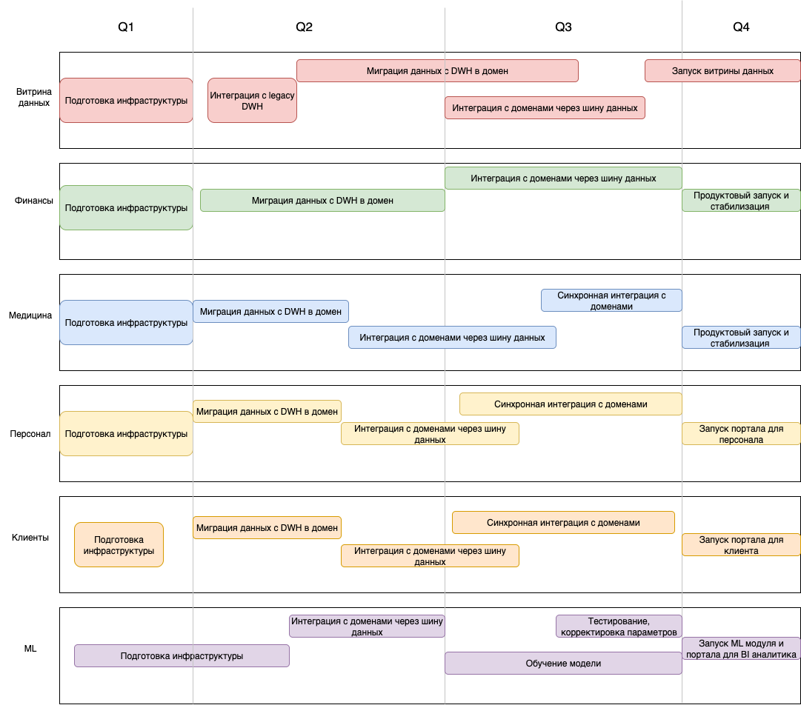

# Тех. радар

# Roadmap

#### По результатам кварталов:
 - Q1:
   - Команды подготовили инфраструктуру для разработки и развертывания решений в каждом домене
   - Команда ML выполнила план по подготовке инфраструктуры на 70%
 - Q2
   - Команда ML завершила подготовку инфраструктуры
   - Команды мигрировали данных из легаси-системы DWH
   - Команда витрины данных интегрировалась с легаси-системой DWH для поддержки существующего функционала; начала миграцию данных
   - Команды начали интеграцию с другими доменами
 - Q3:
   - Команды завершили интеграцию с другими доменами
   - Команды ML обучила модель и приступила к тестированию и корректировке параметров
 - Q4:
   - Команда витрины данных полностью выпустила продукт, избавившись от legacy-интеграции; отчеты формируется быстро
   - Запустились порталы для клиентов, BI-аналитиков и сотрудников
   - Запущен ML модуль

#### Обоснование изменений:
- Подготовка инфраструктуры необходима для независимого развития сервисов (ML система требует больше времени на развертывание инфры)
- Миграция данных из legacy-системы позволяет ускорить формирование отчетов, распределить данные по зонам ответственности (домены) и снизить нагрузку на DWH (один из приоритетов компании)
- Временная интеграция с legacy-системой в домене витрины данных нужна для "переходного периода" и обратной совместимости
- Интеграция с другими доменами необходима для сквозного взаимодействия между системами
- После обучения ML модели и корректировке параметров бизнес сможет делать прогнозы и анализировать данные
- Порталы для сотрудников и клиентов необходимы для удобного взаимодействия с системой через user-friendly интерфейс